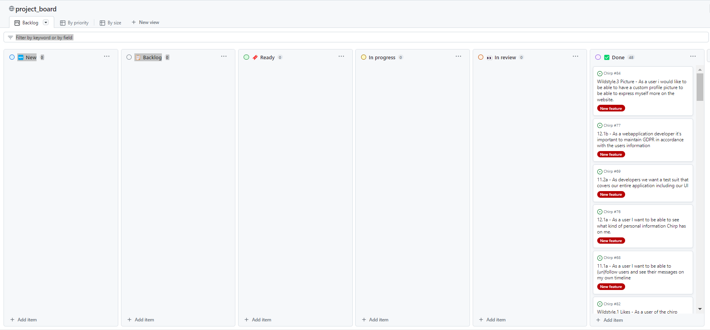

# Design and Architecture of _Chirp!_

## Domain model

The diagram below shows our domain model, the classes are the important entities in our program, as they relate to the real world domain of interest. The identity entitie is made to show that we use asp.net core identity.


## Architecture — In the small

.png>)

## Architecture of deployed application

## User activities

In this segment we present three different user-activity diagrams that illustrates how a user would use our website.

The diagrams below illustrates how a non-authorized user will use the "Chirp!" application there are two very similar diagrams. The left diagram illustrates how a user would login to Chirp, with an existing account. The right diagram illustrates a new user to Chirp! registering an account for the first time.

 

The diagram below illustrates how an authorized user could use the "Chirp!" application. The diagram is illustrated as a loop since most of the tasks that a user could do would end up with them at the front page looking at cheeps. We omitted how a user could interact with the "About me"- and "My timeline"-page. The difference between the "Public timeline" and "My timeline" is the cheeps they show. The "Public timeline" show all cheeps and the "My timeline" only shows personal cheeps and cheeps from authors they follow. The "About me" page we omitted it since a user can change their information and the diagram would look almost identical to the two previous diagrams in this section.


## Sequence of functionality/calls through _Chirp!_

# Process
## Build, test, release, and deployment
In this section we will discuss our continuous deployment of the Chirp software using GitHub Actions. We will provide an in-depth explanation of how our continuous deployment tackles building-, testing- and deploying the program to the web platform, and ensuring working releases for all relevant platforms. Here is an illustration which displays this:


### Building
To build the program we use the "build_and_test.yml" workflow. This workflow runs on pushes and pulls to main branch, this is to view the status of our tests whenever something gets added or merged. In the workflow, the three first steps are responsible for building the program before testing. The first step is "Setup .NET" which uses "actions/setup-dotnet@v3", with dotnet version 7.0. This is responsible for setting up the program before building it, and is a part of the "action/checkout@v3" collection. The next step is to restore dependencies, which is done by running:
``` console
dotnet restore src/Chirp.Razor
```
This is a necessary step to ensure all our dependencies are restored. Lastly we run the "Build" step which runs the
``` console
dotnet build src/Chirp.Razor --no-restore
```
command, which is responsible for building the program so that it can be tested upon.   

### Testing
Running the tests is done with the last step in the "build_and_test.yml" workflow. This step is called "Test" and runs the command: 
``` console
dotnet test test/test.Chirp --no-build --verbosity normal
```
which runs our test suit. We have put a lot of thought and effort into having the correct and necessary tests such as; Unit-, Integration-, and end-to-end tests (also called E2E). These tests are made with the Triple-A principle in mind (arrange, act and assert).

#### Triple A principle
Using the Triple-A principle, of arranging, acting and asserting we always have a consistent way of testing. This methodology revolves around first arranging your test, this means inputting and creating the necessary data structures that we might want to test. We then act upon them by affecting the data and testing some method. Lastly we assert what we expect from our result and compare to what we get. This is a structured way of designing and performing tests to ensure a level of consistency throughout the test suit. These are criteria we have set for our unit test to ensure their validity and usefulness to evaluate whether a functionality works as intended.

#### Unit tests
The unit tests are designed to test the different units of the program. We do this using the Triple-A principle, of arranging acting and asserting. This is a structured way of designing and performing tests to ensure a level of consistency throughout the tests. It is important to consistently and rigourisly test the many different units of the program since we must isolate the written code to test and determine (pass or fail) if it works as intended. 
(Insert unit test example) 

#### In memory 
Along with testing the smallest parts of the program in isolation, and without interacting with external resources. We also want to test the intricate units of the program whilst operating in an in-memory context, for this we use in-memory tests. Executing tests in an in-memory context allows us to simulate external dependencies and involve our in-memory database (sqlite). This essentially allows for more in depth testing, this is also done whilst applying the Triple-A principle. 

#### End to end tests using Playwright
An end-to-end test (referred to as E2E) is a form of test that evaluates the functionality of a program from start to finish, covering a users entire journey. We achieve this test using Playwright, which is a testing library that allows us to automate browser action, interact with web pages, and perform operations that simulate user actions. This means that by using Playwright we can write several tests that ensure we cover an entire users journey and test all the functionalities within, making this a suitable E2E test.
It should be disclosed that we lately have been trying to limit the amount we run our playwright tests since it interacts with the webpage, which we are convinced drain our credits on azure. 

### Release 
The intended use of the release.yml workflow is to create and release zip files, for windows, mac and linux where the program can be found and ran. We have designed our release workflow so that it runs using a for-loop, to reduce redundancy. Furthermore, there are certain requirements for our release workflow to run which we view as crucial for the design of the worklow. The first major requirement our workflow has, is that it only runs once a tag has been pushed. This is important since all releases require a tag, this allows us to describe our tag format so that we are consistent when creating our tags. This can be seen on line 6 in the workflow where the tag format is "v*.*.*" which is in accordance with Semantic versioning (breaking.feature.fix) from session_03. The next major requirement in our release workflow is that we have added the "build_and_test.yml" as a job which needs to run and complete appropriately, meaning the program must build correctly and all the tests must pass before the release job runs. 
This is a suitable requirement since we would never want to release a version of the program where the tests do not pass. 

### Deploy
We deploy using the "main_bdsagroup2chirprazor.yml". This workflow only runs on pushes to main branch, to ensure all new features are deployed to the website. The deploy-workflow consists of two jobs; build and deploy. 
The build job has four steps; The first step is to set up .NET core, second step is to build with dotnet, thirdly it publishes, and lastly it uploads the artifact so it is ready to be deployed through the deploy-job. 
The deploy-job requires the build-job to finish successfully, it then runs using two steps. First step is to download the artifact uploaded by the build job. Second step is to deploy that artifact to the azure web app, once this is done the deployment is finished. 

It is important to note that this workflow makes and runs a separate build-job which does not require tests to pass. We have only found this out now and would have liked to change it, so it is similar to the release workflow. This would reduce redundant code (making a build job when we already have a build_and_test.yml) and it would be more suitable to ensure that we only deploy once all tests pass, since we do not want to deploy a faulty application.

## Team work


We do not have any unfinished issues on our project board we have made all the features that we set out to make, one part of our program that we could have worked more on would have been to add more test, specifically for our wild-style features.

The process we went through was we would meet when new tasks where given to make new issues. Usually two people would sit down and write the coming weeks issues. The other people would work on previous tasks we had not completed yet. We would then delegate the new issues between us. Depending on the problem size we would sometimes work two or three people on one issue using pair programming otherwise it would be a single person working on one issue each. We would also make a new branch, specifically for that issue. We were not the best at using the project board and would often put an issue in the wrong column or place an issue in the "in-progress"-column and then forget all about it, after we finished work. We would then rediscover our old issues and move them to the correct column, the next week when new issues had to be written. If we at that time felt the issue was solved we would then make a pull request to merge into main. Most of the time another member of the team who had not worked on the issue would review and approve the merge, but if no one answered the messages for a pull request. One of the team members who worked on the issue would approve and merge themselves, so the branches did not stay alive for too long.

## How to make _Chirp!_ work locally

There are a few things you need to setup, before you are able to use Chirp locally.
'You will need to install Docker, which you can install from this link:' https://www.docker.com/products/docker-desktop/
You now need to get the database up and running. You now need to run one of these commands depending on your system.

Windows
``` console
docker run -e "ACCEPT_EULA=Y" -e "MSSQL_SA_PASSWORD=6d3a3bdb-7993-42ab-8eb4-5fb4e27ef44a" -p 1433:1433 --name sqlpreview --hostname sqlpreview -d mcr.microsoft.com/mssql/server:2022-latest
```

Mac
``` console
users docker run -e "ACCEPT_EULA=Y" -e "MSSQL_SA_PASSWORD=6d3a3bdb-7993-42ab-8eb4-5fb4e27ef44a" -p 1433:1433 --name sqlpreview --hostname sqlpreview -d mcr.microsoft.com/azure-sql-edge:latest
```
Now the database should be properly set up.

You will now need to run the last set of commands before being able to run the program, the first one is to connect to the database and the two latter is for connecting with GitHub.
``` console
dotnet user-secrets set "ConnectionStrings:ChirpDb" "Server=127.0.0.1,1433; Database=Master; User Id=SA; Password=6d3a3bdb-7993-42ab-8eb4-5fb4e27ef44a; Encrypt=True;TrustServerCertificate=True"
```
``` console
dotnet user-secrets set "GITHUB_PROVIDER_AUTHENTICATION_SECRET" "1d0ace927b02173f9a878119fdb0f5069da49be8"
```
``` console
dotnet user-secrets set "AUTHENTICATION_GITHUB_CLIENTID" "f2b9cc87834340f6215a"
```
To start the program, type dotnet run. Make sure to be in the Chirp.Razor folder with your terminal when running this command. If you should be in the root directory, type cd src/Chirp.Razor in your terminal to go the correct folder.

## How to run test suite locally

To run our in memory tests and unit tests, start by standing at the root of the directory called Chirp. Then from the terminal type ->
cd test/test.Chirp after that run the command -> dotnet test. Within the inMemoryTests.cs file you will find test suites that tests various database methods which lies within the AuthorRepository, CheepRepository and FollowerListRepository. It starts by creating a new database after that it establishes a connection to the database and then seeds it with various cheeps and authors. We use the typical Arrange, Act and Assert notation to test the different repository methods. Once the tests are completed we dispose of the database and all the cheeps and authors within it.

In our UnitTestChirp.cs file you will find some out-commented unit tests. These are all methods that are not in use anymore or they fail which then stops our action workflow from deploying. We chose to use the inLineData format for the tests, this was to test different values on a single method at once. Some of the tests consist of testing the web application such as being able to see the public/private timeline or finding specific users cheeps.

To see our playwright tests stand at the root of our directory Chirp then type in the terminal -> cd test/PlaywrightTests once you are in the directory type -> dotnet test this will run various Razor web application tests. all of the methods starts by connecting to our Azure front webpage. The PlayWright tests works by calling different methods from the Playwright library. these methods are for example GetByRole() or GetByPlaceholder() which essentially finds the desired text field/button and then calls the methods such as FillAsync() or ClickAsync() which fills the field with text or clicks a button respectively. Once that is done and it is on the correct page with the correct information we call the Expect method to check that the correct text is found and if so the test succeeds.

# Ethics

Here we talk about our Ethics.

## License

To choose the license we started by looking at the website https://choosealicense.com/licenses/ to learn which license would fit our needs best, we immediately noticed the different types of permissions conditions and limitations. our group confirmed we wanted as few limitations and conditions as possible because it would be easier for the public to use our code. We Came to the conclusion to choose the MIT license. Just to be sure we asked our TA at one of our meetings if the license was suitable for our project and dependencies. He agreed and we opted for the MIT license.

## LLMs, ChatGPT, CoPilot, and others

When we encountered difficult issues throughout the program and were unable to find an answer right away on the internet, we decided to get some help from ChatGPT. Sometimes it helped us, sometimes we didn't get any further. Whenever we would commit anything that the AI either wrote for us or gave us inspiration for, we would write a commit message, that we had gotten help from ChatGPT.

```

```
